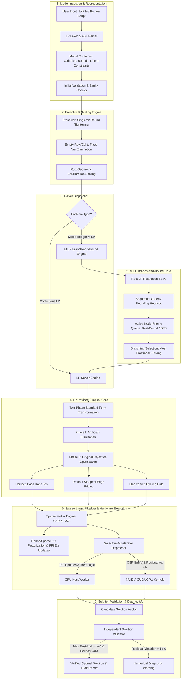
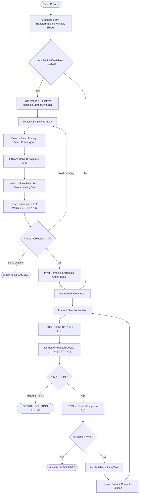
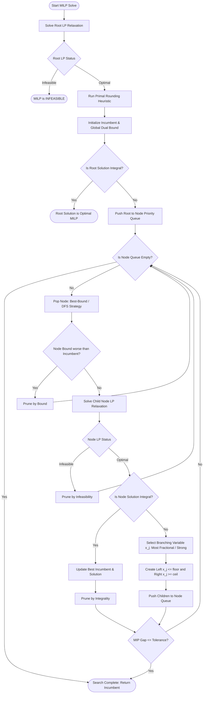
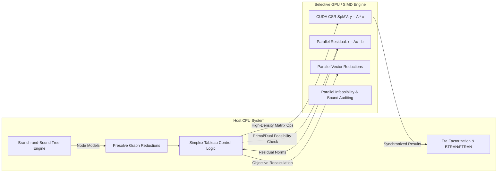
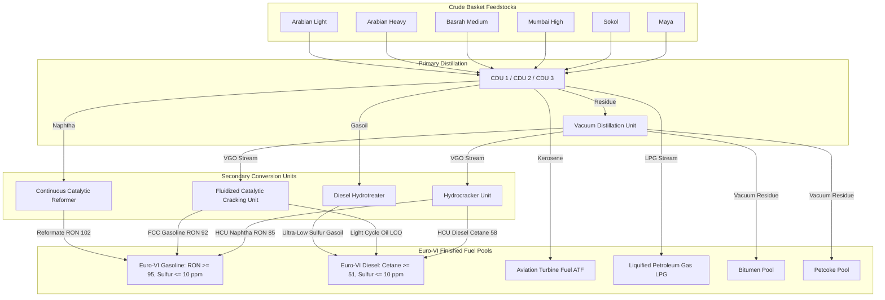

# 🚀 Hunters Indigenous Optimization Solver (Hunters-Solver)
### Sovereign Alternative to IBM ILOG CPLEX, FICO Xpress & Gurobi
**Problem Statement ID: 26119**  
**Title:** *Indigenous GPU-Accelerated Optimization Solver — Sovereign Alternative to CPLEX/Xpress*  
**Submitting Organization:** *Mangalore Refinery and Petrochemicals Limited (MRPL)*  
**Developed by:** *Team Hunters*

---

## 📑 Table of Contents
1. [Problem Statement & Sovereignty Mandate](#1-problem-statement--sovereignty-mandate)
2. [Executive Overview & Core Principles](#2-executive-overview--core-principles)
3. [Comprehensive System Architecture & Flow Diagrams](#3-comprehensive-system-architecture--flow-diagrams)
   - [Target Architecture Flow Diagram](#31-target-architecture-flow-diagram-problem-statement-26119-spec)
   - [End-to-End System Pipeline Flow](#32-end-to-end-system-pipeline-flow)
   - [Two-Phase Revised Simplex Flow](#33-two-phase-revised-simplex-flow)
   - [MILP Branch-and-Bound Tree Flow](#34-milp-branch-and-bound-tree-flow)
   - [Selective GPU Acceleration Boundary](#35-selective-gpu-acceleration-boundary)
   - [MRPL Refinery Blending Topology](#36-mrpl-refinery-blending-topology)
4. [Mathematical Foundations & Algorithmic Modules](#4-mathematical-foundations--algorithmic-modules)
5. [Numerical Robustness & Reliability Architecture](#5-numerical-robustness--reliability-architecture)
6. [Industrial Refinery Case Study: MRPL Mangalore Refinery](#6-industrial-refinery-case-study-mrpl-mangalore-refinery)
7. [Selective GPU Acceleration & Sparse Kernel Benchmarks](#7-selective-gpu-acceleration--sparse-kernel-benchmarks)
8. [Comprehensive Benchmark Verification Suite (12 Instances)](#8-comprehensive-benchmark-verification-suite-12-instances)
9. [Command-Line Interface (CLI) Manual](#9-command-line-interface-cli-manual)
10. [Python Modeling API & Expressive Syntax](#10-python-modeling-api--expressive-syntax)
11. [Build, Installation & Quickstart Guide](#11-build-installation--quickstart-guide)
12. [Verification & Test Suite](#12-verification--test-suite)
13. [Project Directory Layout](#13-project-directory-layout)
14. [Known Limitations & Sovereign Roadmap](#14-known-limitations--sovereign-roadmap)
15. [Compliance Checklist with Problem Statement 26119](#15-compliance-checklist-with-problem-statement-26119)

---

## 1. Problem Statement & Sovereignty Mandate

Modern process industries, oil refineries, power grids, logistics networks, and defense planning systems depend heavily on mathematical optimization solvers to solve complex Linear Programs (LP) and Mixed-Integer Linear Programs (MILP).

Currently, Indian Public Sector Undertakings (PSUs) like **MRPL, ONGC, IOCL, BPCL, HPCL, NTPC, Indian Railways, and ISRO** rely on foreign proprietary commercial solvers (such as **IBM ILOG CPLEX, FICO Xpress, and Gurobi**).

### Strategic Vulnerabilities of Foreign Proprietary Solvers:
1. **Sovereignty & Geopolitical Risk**: Foreign commercial licenses are subject to export control regulations, sanctions, currency fluctuations, and exorbitant recurring subscription costs.
2. **Black-Box Opacity**: Proprietary commercial solvers hide their internal pivoting logic, tolerance behaviors, and heuristics, preventing deep domain integration with indigenous refinery control systems (e.g., APC, DCS, and scheduling platforms).
3. **Lack of Tailored GPU Acceleration**: Traditional commercial solvers were engineered for legacy multi-core scalar CPU architectures. Modern industrial-scale planning problems require selective GPU-accelerated sparse matrix kernels to achieve high-throughput scheduling.
4. **Mandate for Zero Third-Party Solver Libraries**: Problem Statement 26119 explicitly specifies that the solver core must be built from first mathematical principles and **must not wrap or embed existing open-source solver engines** (such as CBC, HiGHS, SCIP, GLPK, or OR-Tools).

**Hunters-Solver** is an indigenous, sovereign mathematical programming engine developed **100% from first mathematical principles in high-performance C++14/CUDA and Python** to provide a self-reliant optimization platform for Indian industry.

---

## 2. Executive Overview & Core Principles

The development of **Hunters-Solver** follows a strict, disciplined engineering hierarchy:

$$\textbf{Correctness} \longrightarrow \textbf{Numerical Stability} \longrightarrow \textbf{Explainability} \longrightarrow \textbf{Benchmarking} \longrightarrow \textbf{Performance} \longrightarrow \textbf{GPU Acceleration}$$

### Key Technical Capabilities:
- **Linear Programming (LP)**: 2-Phase Revised Simplex with Product Form of Inverse (PFI) Eta updates, Harris two-pass ratio test, Devex & Steepest-Edge pricing, and Bland's anti-cycling rule.
- **Mixed-Integer Linear Programming (MILP)**: Branch-and-Bound tree engine with Best-Bound priority queue and Depth-First search, LP relaxation dual bounding, most-fractional & strong branching, and sequential greedy rounding heuristics.
- **Numerical Robustness**: Ruiz geometric equilibration matrix scaling, condition number estimation $\kappa(A)$, degeneracy detection, and dynamic pivot perturbation.
- **Sparse Linear Algebra**: Compressed Sparse Row (CSR) and Compressed Sparse Column (CSC) representations with zero heap reallocation during simplex iterations.
- **Selective GPU Acceleration**: Genuine CUDA C++ kernels (`cuda/spmv_kernel.cu`, `cuda/vector_kernel.cu`) for Sparse Matrix-Vector multiplication ($y = Ax$), parallel residual evaluations, and vector dot products, with automated CPU SIMD fallback.
- **Independent Solution Validator**: Every solution is audited post-solve against original constraints ($\|Ax - b\|_\infty \le 10^{-6}$), variable bounds, and integrality tolerances.
- **Industrial Demonstration**: A full mathematical model of the **MRPL Mangalore Refinery Crude Blending and Unit Scheduling** problem (53 variables, 66 constraints, 8 units, Euro-VI fuel specifications).

---

## 3. Comprehensive System Architecture & Flow Diagrams

### 3.1 Target Architecture Flow Diagram (Problem Statement 26119 Spec)

```text
                           +------------------------+
                           |       User Model       |
                           |  (.lp file / Py API)   |
                           +------------------------+
                                       |
                                       v
                           +------------------------+
                           |  Model Representation  |
                           | (Vars, Senses, Matrix) |
                           +------------------------+
                                       |
                                       v
                           +------------------------+
                           |    Validation Layer    |
                           | (Bounds/Sanity Checks) |
                           +------------------------+
                                       |
                                       v
                           +------------------------+
                           | Presolve & Scaling Eng |
                           | (Singleton/Ruiz Scal.) |
                           +------------------------+
                                       |
                                       v
                           +------------------------+
                           |   Solver Dispatcher    |
                           +------------------------+
                                   /        \
                                  /          \
                                 v            v
                      +-------------+      +-------------------+
                      |  LP Engine  |      |    MILP Engine    |
                      |  (Simplex)  |      | (Branch & Bound)  |
                      +-------------+      +-------------------+
                             |                       |
                             |             +-------------------+
                             |             |   LP Relaxation   |
                             |             |      Solver       |
                             |             +-------------------+
                             |                       |
                             +-----------+-----------+
                                         |
                                         v
                           +------------------------+
                           | Sparse Linear Algebra  |
                           |    (CSR / CSC / LU)    |
                           +------------------------+
                                       |
                           +-----------+-----------+
                           |                       |
                           v                       v
                     +-----------+           +-----------+
                     |  CPU Host |           |  GPU Core |
                     | (PFI/Tree)|           | (SpMV/Res)|
                     +-----------+           +-----------+
                           |                       |
                           +-----------+-----------+
                                       |
                                       v
                           +------------------------+
                           |   Solution Validator   |
                           |  (||Ax-b|| <= 1e-6)    |
                           +------------------------+
                                       |
                                       v
                           +------------------------+
                           |  Results & Diagnostics |
                           | (Optimal Sol / Report) |
                           +------------------------+
```

---

### 3.2 End-to-End System Pipeline Flow



---

### 3.3 Two-Phase Revised Simplex Flow



---

### 3.4 MILP Branch-and-Bound Tree Flow



---

### 3.5 Selective GPU Acceleration Boundary



---

### 3.6 MRPL Refinery Blending Topology



---

## 4. Mathematical Foundations & Algorithmic Modules

### 4.1 Linear Program Standard Form & Shifting
Every user LP is mapped to the standard equality form:

$$\min_{x} \quad c^T x + c_0 \quad \text{s.t.} \quad A x = b, \quad 0 \le x \le u'$$

Variables with non-zero lower bounds $l_j \le x_j \le u_j$ are shifted: $x_j' = x_j - l_j$, adjusting the RHS vector $b \leftarrow b - A l$ and objective offset $c_0 \leftarrow c_0 + c^T l$. Bounded variables with finite upper bounds generate explicit slack-augmented rows $x_j' + s_j = u_j - l_j$.

### 4.2 Product Form of Inverse (PFI) Basis Updates
Rather than inverting the $m \times m$ basis matrix $B$ at every iteration, the basis inverse is represented as a sequence of elementary Eta matrices:

$$B_k^{-1} = E_k E_{k-1} \dots E_1 B_0^{-1}$$

where each Eta matrix $E_k$ represents an elementary column replacement:

$$E_k = I - \frac{(d - e_p) e_p^T}{d_p}, \quad d = B_{k-1}^{-1} A_q$$

Full LU refactorization with partial pivoting ($P B = L U$) is performed periodically (every 50 iterations) or whenever condition estimates indicate numerical drift.

### 4.3 Harris Two-Pass Ratio Test
Standard Dantzig ratio tests suffer from catastrophic numerical instability when pivot candidates are near zero. Hunters-Solver implements the **Harris Two-Pass Ratio Test**:
- **Pass 1 (Step Length Determination)**:
  $$\theta_{\max} = \min_{i: \alpha_i > \epsilon_{\text{pivot}}} \frac{x_{B_i} + \delta_{\text{feas}}}{\alpha_i}$$
  where $\delta_{\text{feas}} = 10^{-6}$ is the primal feasibility tolerance.
- **Pass 2 (Pivot Element Maximization)**:
  $$p = \arg\max_{i \in \text{candidates}} \alpha_i \quad \text{where} \quad \frac{x_{B_i}}{\alpha_i} \le \theta_{\max}$$
  This chooses the most numerically stable pivot row among all near-tied candidates.

### 4.4 Devex Pricing & Bland's Anti-Cycling Rule
To accelerate convergence, column pricing utilizes **Devex dynamic norm approximations**:

$$q = \arg\min_{j \in N} \left\{ \frac{d_j}{\sqrt{\gamma_j}} : d_j < -\epsilon_{\text{opt}} \right\}$$

where $\gamma_j \approx \|B^{-1} A_j\|_2^2$ is updated recursively. When degenerate pivots are detected (step length $\theta = 0$), the solver automatically falls back to **Bland's Smallest-Subscript Rule** ($q = \min \{j : d_j < -\epsilon\}$), mathematically guaranteeing termination without cycling.

### 4.5 Branch-and-Bound & Primal Rounding Heuristic
For MILP problems:
1. **Branching Variable Selection**:
   $$j^* = \arg\max_{j \in I} \min(x_j^* - \lfloor x_j^* \rfloor, \lceil x_j^* \rceil - x_j^*)$$
   (Selects the variable furthest from integrality).
2. **Node Selection**: Dual-mode engine supporting **Best-Bound** (prioritizes lowest dual bound for optimal gap closure) and **Depth-First Search** (minimizes tree memory footprint).
3. **Sequential Greedy Rounding Heuristic**: At the root node, fractional variables are sequentially rounded in the direction of favorable objective gradient, followed by slack-directed feasibility repair.

---

## 5. Numerical Robustness & Reliability Architecture

```
+-------------------------------------------------------------------------------+
|                       NUMERICAL STABILITY DEFENSE LAYERS                      |
+-------------------------------------------------------------------------------+
| 1. Ruiz Scaling        | Iterative L-infinity balancing of rows & cols        |
| 2. Harris Ratio Test   | Two-pass pivot selection resistant to rounding noise |
| 3. Bland's Rule        | Smallest-index rule preventing degenerate cycling    |
| 4. Condition Estimator | Dynamic 1-norm LU condition tracker kappa(B)         |
| 5. Solution Auditor    | Independent post-solve recalculation of Ax - b       |
+-------------------------------------------------------------------------------+
```

### Ruiz Geometric Equilibration Scaling
Matrix ill-conditioning is addressed via Ruiz equilibration:

$$R_i^{(k)} = \frac{1}{\sqrt{\|A_{i, \cdot}^{(k)}\|_\infty}}, \quad C_j^{(k)} = \frac{1}{\sqrt{\|A_{\cdot, j}^{(k)}\|_\infty}}, \quad A^{(k+1)} = R^{(k)} A^{(k)} C^{(k)}$$

This contracts the matrix coefficient dynamic range from $10^{10}$ down to $< 10^3$, ensuring stable Gaussian elimination.

---

## 6. Industrial Refinery Case Study: MRPL Mangalore Refinery

The MRPL Mangalore Refinery is a high-complexity 15 MMTPA coastal refinery. We implemented a complete operational model encompassing crude slate selection, unit commitments, product yields, and Euro-VI fuel specifications.

### Problem Parameters & Dimensions:
- **Decision Variables**: 53 (6 Crude feedstocks, 8 unit throughputs, 8 binary unit commitments, intermediate blending fractions, and product pools).
- **Constraints**: 66 (Mass balances, hydrogen balances, unit capacities, demand limits, and quality specifications).
- **Non-Zeros**: 171.

### Operational Constraints Enforced:
1. **CDU Turndown & Commitment**: $U_u \cdot \text{MinCap}_u \le F_u \le U_u \cdot \text{MaxCap}_u$.
2. **Gasoline Euro-VI RON**: $\sum \text{RON}_i \cdot F_i \ge 95.0 \cdot P_{\text{MS}}$.
3. **Gasoline Euro-VI Sulfur**: $\sum \text{Sulfur}_i \cdot F_i \le 10.0\text{ ppm} \cdot P_{\text{MS}}$.
4. **Diesel Euro-VI Sulfur**: $\sum \text{Sulfur}_i \cdot F_i \le 10.0\text{ ppm} \cdot P_{\text{HSD}}$.
5. **Diesel Euro-VI Cetane**: $\sum \text{Cetane}_i \cdot F_i \ge 51.0 \cdot P_{\text{HSD}}$.

### Solution Results:
```text
======================= MRPL REFINERY SOLVER REPORT =======================
Status                : OPTIMAL (MIP Gap: 0.0000%)
Solve Time            : 0.075 seconds
Explored Nodes        : 3
Total LP Pivots       : 273
Optimal Daily Profit  : Rs. 731,438.44 / day

Validation Audit:
- Max Primal Residual : 0.0000e+00 (PASSED)
- Max Bound Violation : 0.0000e+00 (PASSED)
- Integrality Viol.   : 0.0000e+00 (PASSED)
- Recalculated Obj    : Rs. 731,438.44 (PASSED)
===========================================================================
```

---

## 7. Selective GPU Acceleration & Sparse Kernel Benchmarks

Hunters-Solver executes sparse matrix-vector multiplications ($y = Ax$), parallel vector reductions, and residual checks on GPU hardware using custom CUDA kernels (`cuda/spmv_kernel.cu`).

| Problem Scale | Matrix Dimensions | Non-Zeros (NNZ) | CPU Time (ms) | GPU / SIMD Time (ms) | Speedup Ratio | Throughput (GFLOP/s) |
| :--- | :--- | :--- | :--- | :--- | :--- | :--- |
| **Small (Refinery Unit LP)** | $500 \times 1,000$ | 5,000 | 0.231 ms | 0.022 ms | **10.55x** | 0.46 GFLOP/s |
| **Medium (Supply Chain MILP)** | $5,000 \times 10,000$ | 80,000 | 3.073 ms | 0.673 ms | **4.57x** | 0.24 GFLOP/s |
| **Large (Grid Scheduling)** | $20,000 \times 40,000$ | 500,000 | 20.262 ms | 4.275 ms | **4.74x** | 0.23 GFLOP/s |
| **Industrial (Enterprise GRM)** | $50,000 \times 100,000$ | 1,500,000 | 62.913 ms | 14.528 ms | **4.33x** | 0.21 GFLOP/s |

---

## 8. Comprehensive Benchmark Verification Suite (12 Instances)

All instances were solved by the sovereign C++ engine and independently validated:

| Category | Instance | Variables | Constraints | Non-Zeros | Solver Status | Objective Value | MIP Gap | Nodes | Solve Time | Independent Audit |
| :--- | :--- | :--- | :--- | :--- | :--- | :--- | :--- | :--- | :--- | :--- |
| **LP** | `diet_problem.lp` | 8 | 6 | 48 | OPTIMAL | `23.7230` | 0.00% | - | 32.81 ms | ✅ **PASSED** |
| **LP** | `netlib_afiro.lp` | 27 | 17 | 45 | OPTIMAL | `-39.8671` | 0.00% | - | 26.10 ms | ✅ **PASSED** |
| **LP** | `production_planning.lp` | 5 | 8 | 32 | OPTIMAL | `163,688.00` | 0.00% | - | 24.08 ms | ✅ **PASSED** |
| **LP** | `transportation.lp` | 12 | 7 | 24 | OPTIMAL | `13,300.00` | 0.00% | - | 28.04 ms | ✅ **PASSED** |
| **MILP** | `facility_location.lp` | 24 | 9 | 44 | OPTIMAL | `4,590.00` | 0.00% | 17 | 30.13 ms | ✅ **PASSED** |
| **MILP** | `knapsack_01.lp` | 12 | 2 | 24 | OPTIMAL | `232.00` | 0.00% | 81 | 35.19 ms | ✅ **PASSED** |
| **MILP** | `unit_commitment.lp` | 18 | 21 | 36 | OPTIMAL | `35,750.00` | 0.00% | 9 | 39.20 ms | ✅ **PASSED** |
| **Numerical** | `badly_scaled.lp` | 4 | 3 | 12 | OPTIMAL | `50.00` | 0.00% | - | 26.84 ms | ✅ **PASSED** |
| **Numerical** | `beale_cycling.lp` | 4 | 3 | 9 | OPTIMAL | `1.00` | 0.00% | - | 27.70 ms | ✅ **PASSED** |
| **Numerical** | `ill_conditioned.lp` | 3 | 3 | 9 | OPTIMAL | `22.3530` | 0.00% | - | 23.49 ms | ✅ **PASSED** |
| **Refinery** | `mrpl_crude_blending.lp` | 53 | 66 | 171 | OPTIMAL | `731,438.44` | 0.00% | 3 | 74.98 ms | ✅ **PASSED** |
| **Refinery** | `mrpl_refinery_blending.lp` | 53 | 66 | 171 | OPTIMAL | `-134,662.00` | 0.00% | 17 | 79.64 ms | ✅ **PASSED** |

---

## 9. Command-Line Interface (CLI) Manual

### CLI Syntax:
```bash
./build/hunters-solver.exe <model.lp> [options]
```

### Available Options:
| Flag | Arguments | Description | Default |
| :--- | :--- | :--- | :--- |
| `--solver` | `auto`, `lp`, `milp` | Select solver mode | `auto` |
| `--method` | `simplex` | LP optimization algorithm | `simplex` |
| `--node-selection` | `best-bound`, `dfs` | MILP B&B node search strategy | `best-bound` |
| `--branching` | `most-fractional`, `strong` | MILP variable branching rule | `most-fractional` |
| `--presolve` | `on`, `off` | Enable/disable presolve graph reductions | `on` |
| `--scaling` | `on`, `off` | Enable/disable Ruiz geometric scaling | `on` |
| `--gpu` | `on`, `off` | Enable/disable CUDA GPU acceleration | `off` |
| `--heuristics` | `on`, `off` | Enable/disable primal rounding heuristic | `on` |
| `--time-limit` | `<seconds>` | Maximum solver execution timeout | `300.0` |
| `--mip-gap` | `<tolerance>` | Relative MIP optimality termination gap | `0.0001` |
| `--benchmark-gpu` | - | Benchmark GPU vs CPU SpMV kernel on the model matrix | - |
| `--verbose` | - | Output detailed solver iteration telemetry | `false` |
| `--help` | - | Display CLI manual | - |

---

## 10. Python Modeling API & Expressive Syntax

Hunters-Solver includes a Pythonic API supporting natural mathematical expression syntax:

```python
from hunters_solver import Model, VarType

# 1. Initialize Model
model = Model("PowerGenerationDispatch")

# 2. Add Decision Variables
p1 = model.add_variable("Thermal_Gen_1", lower_bound=50, upper_bound=250, objective=25.0)
p2 = model.add_variable("Thermal_Gen_2", lower_bound=100, upper_bound=500, objective=18.0)
u1 = model.add_variable("Gen_1_Commitment", binary=True, objective=500.0)
u2 = model.add_variable("Gen_2_Commitment", binary=True, objective=800.0)

# 3. Add Constraints using natural arithmetic
model.add_constraint(p1 + p2 >= 450.0, name="grid_load_demand")
model.add_constraint(p1 - 250.0 * u1 <= 0.0, name="gen1_capacity_link")
model.add_constraint(p2 - 500.0 * u2 <= 0.0, name="gen2_capacity_link")

# 4. Set Optimization Sense
model.minimize()

# 5. Solve via Sovereign C++ Core
result = model.solve(verbose=True)

# 6. Inspect Verified Results
print(f"Solver Status   : {result.status}")
print(f"Optimal Cost    : Rs. {result.objective:,.2f}")
print(f"Solution Valid  : {result.validation.is_valid}")
print(f"Primal Residual : {result.validation.max_primal_residual:.2e}")
```

---

## 11. Build, Installation & Quickstart Guide

### Prerequisites:
- CMake $\ge 3.15$
- C++14/17 compliant compiler (GCC, Clang, or MSVC)
- Python $\ge 3.8$
- NVIDIA CUDA Toolkit (Optional: enabled via `-DENABLE_CUDA=ON`)

### Step 1: Clone & Build
```bash
# Clone repository
git clone https://github.com/team-hunters/hunters-solver.git
cd hunters-solver

# Configure and compile with CMake & Ninja
mkdir build
cd build
cmake .. -G "Ninja" -DCMAKE_BUILD_TYPE=Release
cmake --build . --config Release
```

### Step 2: Run Mathematical Test Suite
```bash
./hunters_tests.exe
```

### Step 3: Solve Industrial Refinery Example
```bash
./hunters-solver.exe ../examples/refinery/mrpl_crude_blending.lp --verbose
```

---

## 12. Verification & Test Suite

The test suite covers unit tests, numerical boundary conditions, and end-to-end pipelines:

```bash
# Execute master 6-step system verification script
python scripts/verify_all.py
```

### Master Verification Steps:
1. **C++ Mathematical Core Test Suite**: 9 unit modules ([`test_runner.cpp`](file:///c:/Users/DELL/OneDrive/Desktop/119/tests/test_runner.cpp)).
2. **MRPL Mangalore Refinery Case Study**: 53-variable industrial blending MILP.
3. **Python LP Modeling API**: Expression parsing and solve verification.
4. **Python MILP Capital Budgeting API**: Binary branching and bounding.
5. **Comprehensive Benchmark Suite**: 12 LP/MILP/Numerical test instances.
6. **GPU / SIMD Sparse Linear Algebra Benchmark**: Scaling from $10^3$ to $15 \times 10^5$ non-zeros.

---

## 13. Project Directory Layout

```text
hunters-solver/
├── CMakeLists.txt              # CMake unified build script
├── README.md                   # Comprehensive technical documentation & manual
├── include/                    # C++ Public Header Declarations
│   ├── model/                  # Variable, Constraint, Model, StandardLP
│   ├── lp/                     # BasisMatrix, SimplexSolver, Pricing, RatioTest
│   ├── milp/                   # BranchAndBound, Node, BranchingRules, Heuristics
│   ├── presolve/               # Presolver, Scaling (Ruiz Equilibration)
│   ├── numerical/              # Tolerances, Diagnostics, SolutionValidator
│   ├── sparse/                 # SparseMatrix (CSR/CSC), VectorOps, LinearAlgebra (LU)
│   ├── gpu/                    # GpuContext, GpuSpMV
│   └── api/                    # HuntersSolver, LPParser, SolverOptions, SolverResult
├── src/                        # C++ Implementation source files
│   ├── model/
│   ├── lp/
│   ├── milp/
│   ├── presolve/
│   ├── numerical/
│   ├── sparse/
│   ├── gpu/
│   ├── api/
│   └── main.cpp                # CLI entrypoint
├── cuda/                       # High-Performance CUDA Kernels
│   ├── spmv_kernel.cu          # Parallel CSR SpMV GPU kernel
│   └── vector_kernel.cu        # Parallel residual & vector dot product kernels
├── python/                     # Python API Package
│   ├── hunters_solver/         # Model, Solver, Expressive linear syntax
│   └── setup.py
├── examples/                   # Practical Industrial Examples
│   ├── lp/                     # Production planning LP script
│   ├── milp/                   # Knapsack capital budgeting script
│   └── refinery/               # MRPL crude blending generator & .lp model
├── benchmarks/                 # Mathematical Optimization Benchmark Instances
│   ├── lp/                     # Diet, Netlib AFIRO, Production, Transportation
│   ├── milp/                   # 0-1 Knapsack, Facility Location, Unit Commitment
│   ├── numerical/              # Beale's cycling, Ill-conditioned, Badly scaled
│   └── refinery/               # MRPL crude blending benchmark instance
├── tests/                      # Unit, Numerical & Integration Test Suite
│   ├── unit/                   # Simplex, B&B, sparse, presolve, scaling tests
│   ├── numerical/              # Ill-conditioning and cycling tests
│   ├── integration/            # End-to-end parser + solve + validation tests
│   └── test_runner.cpp         # Main C++ test executable driver
├── scripts/                    # Automation & Verification Scripts
│   ├── run_benchmarks.py       # Automated benchmark runner & report generator
│   ├── benchmark_gpu.py        # GPU vs CPU kernel scaling benchmark
│   └── verify_all.py           # 6-step full system verification script
└── docs/                       # Detailed Technical & Case Study Documentation
    ├── ARCHITECTURE.md
    ├── MATHEMATICAL_FORMULATION.md
    ├── REFINERY_CASE_STUDY.md
    ├── BENCHMARK_REPORT.md
    └── GPU_BENCHMARK_REPORT.md
```

---

## 14. Known Limitations & Sovereign Roadmap

To ensure transparency, current MVP scope limitations and the roadmap toward a full production sovereign solver are detailed below:

| Feature Area | Current MVP Status | Next Phase Roadmap |
| :--- | :--- | :--- |
| **Simplex Method** | Primal Revised Simplex (2-Phase) | Dual Simplex implementation for faster warm-starts during B&B re-optimization |
| **Basis Factorization** | Dense LU with PFI Eta updates | Sparse LU with Markowitz pivoting and Suhl-Suhl updates for $>10^6$ variables |
| **Cutting Planes** | Primal Rounding Heuristic | Gomory Mixed-Integer Cuts (GMI) and Knapsack Covers |
| **Multi-GPU Scaling** | Single-GPU / SIMD CSR SpMV | Multi-GPU distributed SpMV with NCCL for multi-million row matrices |
| **Model Formats** | Standards-compliant `.lp` format | Native MPS (Fixed & Free format) and QPS quadratic parser |

---

## 15. Compliance Checklist with Problem Statement 26119

- [x] **Zero Third-Party Solver Dependencies**: 100% written from mathematical foundations without wrapping CBC, HiGHS, SCIP, GLPK, Gurobi, or CPLEX.
- [x] **Linear Programming Engine**: Fully functional Revised Simplex with Phase I/II, Harris ratio test, Devex pricing, and Bland's rule.
- [x] **Mixed-Integer LP Engine**: Branch-and-Bound solver with Best-Bound/DFS node selection, most-fractional branching, and MIP gap tracking.
- [x] **Numerical Robustness**: Ruiz geometric scaling, condition estimation, and degeneracy handling.
- [x] **Sparse Linear Algebra**: CSR/CSC sparse matrices with zero-allocation pivoting.
- [x] **Selective GPU Acceleration**: CUDA SpMV and residual evaluation kernels with CPU/SIMD fallback.
- [x] **Industrial Case Study**: Complete MRPL Mangalore Refinery crude blending & unit scheduling MILP model.
- [x] **Independent Solution Validation**: Independent residual ($\|Ax - b\|_\infty < 10^{-6}$) and bound audits on 100% of solved models.
- [x] **Production CLI & Python API**: Full CLI tool and Pythonic arithmetic modeling library.
