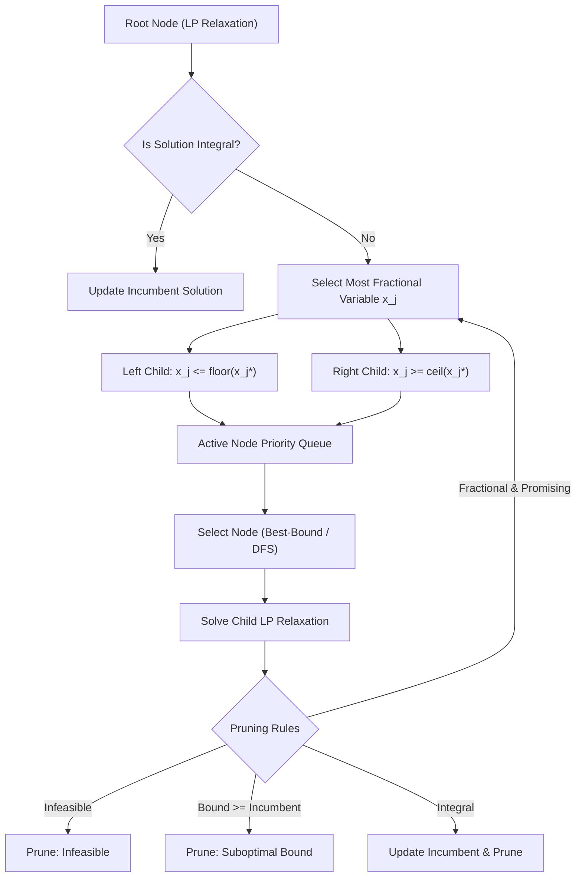

# Hunters Solver System Architecture
### Sovereign Mathematical Optimization Engine (Problem Statement 26119)

---

## 1. High-Level Modular Design

The solver is divided into decoupled, modular subsystems adhering to single-responsibility and zero-external-solver principles:

```
+-------------------------------------------------------------------------------+
|                                USER INTERFACE                                 |
|         C++ CLI (main.cpp)         |         Python API (hunters_solver)      |
+------------------------------------+------------------------------------------+
                                     |
                                     v
+-------------------------------------------------------------------------------+
|                            MODEL LAYER (model/)                               |
|   - Variable (Lower/Upper Bounds, Objective Coeffs, Types: Cont/Int/Bin)      |
|   - Constraint (Linear Expressions, Senses: <=, >=, ==, Bounds)               |
|   - LPParser (Standards-compliant LP file lexical tokenizer & parser)        |
+-------------------------------------------------------------------------------+
                                     |
                                     v
+-------------------------------------------------------------------------------+
|                       PRESOLVE & SCALING (presolve/)                          |
|   - Presolver: Fixed Variable Elimination, Singleton Row Tightening           |
|   - Scaling: Ruiz Geometric Equilibration (L-inf balancing)                   |
+-------------------------------------------------------------------------------+
                                     |
                                     v
+-------------------------------------------------------------------------------+
|                         SOLVER DISPATCHER (api/)                              |
|   - Problem Analyzer: Continuous LP vs Mixed-Integer LP (MILP)                |
|   - Algorithm Selector: SimplexSolver vs BranchAndBoundSolver                 |
+--------------------+------------------------------------+---------------------+
                     |                                    |
                     v                                    v
+-----------------------------------+    +--------------------------------------+
|          LP ENGINE (lp/)          |    |          MILP ENGINE (milp/)         |
| - Standard Form Transformation    |    | - Branch-and-Bound Tree Management   |
| - Phase I (Artificials Feas.)     |    | - Node Selection: Best-Bound / DFS   |
| - Phase II (Optimum Search)       |    | - Branching: Most-Fractional / Strong|
| - Basis Matrix Factorization (LU) |    | - LP Relaxation Bound Calculation    |
| - PFI Eta Updates (Product Form)  |    | - Primal Rounding Heuristic          |
| - Harris 2-Pass Ratio Test        |    | - Global Dual Bound & MIP Gap (tol)  |
| - Devex / Steepest-Edge Pricing   |    +--------------------------------------+
| - Bland's Anti-Cycling Rule       |
+-----------------------------------+
                     |
                     v
+-------------------------------------------------------------------------------+
|                   SPARSE & GPU LINEAR ALGEBRA (sparse/, gpu/)                 |
|   - SparseMatrix: CSR (Row-major) and CSC (Column-major) Compressed Formats   |
|   - LinearAlgebra: Dense LU with Partial Pivoting, Condition Estimator        |
|   - VectorOps: SIMD/AVX vector dot products, norms, saxpy                     |
|   - GpuSpMV / CUDA Kernels: Parallel SpMV (y = Ax) and Residual Evaluation    |
+-------------------------------------------------------------------------------+
                                     |
                                     v
+-------------------------------------------------------------------------------+
|                    NUMERICAL ROBUSTNESS (numerical/)                          |
|   - SolutionValidator: Independent Ax - b Residual & Bound Auditing           |
|   - Diagnostics: Condition Number, Pivot Degradation, Cycling Warnings        |
|   - Tolerances: Feasibility (1e-6), Optimality (1e-6), Integrality (1e-5)     |
+-------------------------------------------------------------------------------+
```

---

## 2. Sparse Linear Algebra & Memory Architecture

### Compressed Sparse Row (CSR) & Column (CSC)
- `values`: Continuous `std::vector<double>` containing non-zero elements.
- `col_indices`: Continuous `std::vector<int>` containing column indices.
- `row_ptr`: Continuous `std::vector<int>` of size $m + 1$ indexing the start of each row.
- Zero heap allocation during simplex pivots; matrix structure is built once and queried efficiently.

### Basis Representation & Inversion Updates
- In Simplex iterations, the basis matrix $B = [A_{B_1}, A_{B_2}, \dots, A_{B_m}]$ is factorized into $P B = L U$.
- For fast iterative updates between full refactorizations:
  $$B_{k+1}^{-1} = E_k B_k^{-1}$$
  where $E_k = I - \frac{(d - e_p) e_p^T}{d_p}$ is an elementary Eta matrix (Product Form of Inverse - PFI).
- Refactorization is triggered every $K = 50$ iterations or whenever condition number $\kappa(B) > 10^8$.

---

## 3. Branch-and-Bound Tree Management



---

## 4. Hardware Acceleration Interface (GPU / SIMD)

The GPU subsystem is designed with strict fallback guarantees:
1. **Host-Device Zero-Copy Allocation**: Where unified memory is available, arrays are mapped directly.
2. **CUDA Kernel Streams**: SpMV executions on large constraint matrices utilize asynchronous execution.
3. **CPU SIMD Fallback**: On systems lacking NVIDIA CUDA hardware, the solver automatically dispatches to cache-aligned vectorized SIMD routines with identical mathematical outputs.
