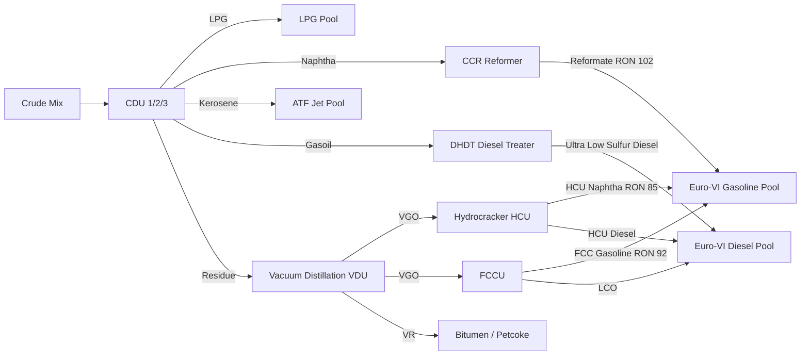

# Industrial Refinery Case Study: MRPL Mangalore Refinery Optimization
### Sovereign Mathematical Optimization Engine (Problem Statement 26119)

---

## 1. Background: Mangalore Refinery & Petrochemicals Limited (MRPL)

MRPL operates a complex 15 MMTPA (Million Metric Tonnes Per Annum) coastal refinery in Mangalore, Karnataka, featuring high-complexity secondary conversion units designed to process heavy, sour, and high-TAN crudes into premium Euro-VI compliant transport fuels.

### Strategic Planning Challenges:
- **Crude Basket Selection**: Blending opportunity crudes (High TAN, High Sulfur, Heavy API) while adhering to metallurgy and unit processing limits.
- **Unit Turndown & Startup Costs**: Discrete on/off operating decisions for CDU trains, FCCU, Reformers, and Hydrocrackers.
- **Strict Quality Specs**: Euro-VI standards enforce $<10$ ppm sulfur in diesel and gasoline, alongside tight octane (RON $\ge 95$) and cetane ($\ge 51$) thresholds.

---

## 2. Mathematical Model Structure

### Decision Variables
- **Crude Quantities ($C_k$)**: $C_{\text{Arabian Light}}, C_{\text{Arabian Heavy}}, C_{\text{Basrah Medium}}, C_{\text{Mumbai High}}, C_{\text{Sokol}}, C_{\text{Maya}}$ (Metric Tonnes/Day).
- **Unit Throughputs ($F_u$)**: $F_{\text{CDU1}}, F_{\text{CDU2}}, F_{\text{CDU3}}, F_{\text{VDU}}, F_{\text{CCR}}, F_{\text{FCC}}, F_{\text{HCU}}, F_{\text{DHDT}}$.
- **Binary Unit Commitment ($U_u \in \{0, 1\}$)**: On/Off states with operating cost penalties.
- **Product Yields ($P_p$)**: $P_{\text{EuroVI\_MS}}, P_{\text{EuroVI\_HSD}}, P_{\text{ATF}}, P_{\text{LPG}}, P_{\text{Bitumen}}, P_{\text{Petcoke}}$.

---

## 3. Refinery Unit Topology & Mass Balance



---

## 4. Key Equations & Specifications

### 1. Daily Gross Refining Margin Objective:
$$\max \sum_{p} \text{Price}_p \cdot P_p - \sum_{k} \text{Cost}_k \cdot C_k - \sum_{u} \text{Opex}_u \cdot F_u - \sum_{u} \text{FixedCost}_u \cdot U_u$$

### 2. Capacity & Semi-Continuous Limits:
$$U_u \cdot \text{MinCap}_u \le F_u \le U_u \cdot \text{MaxCap}_u \quad \forall u$$

### 3. Euro-VI Product Quality Constraints:
- **Gasoline Octane**:
  $$\frac{102 F_{\text{CCR}} + 92 F_{\text{FCC}} + 85 F_{\text{HCU}} + 68 B_{\text{SRN}}}{P_{\text{EuroVI\_MS}}} \ge 95.0$$
- **Gasoline Max Sulfur**:
  $$\frac{0.5 F_{\text{CCR}} + 15.0 F_{\text{FCC}} + 1.0 F_{\text{HCU}} + 80.0 B_{\text{SRN}}}{P_{\text{EuroVI\_MS}}} \le 10.0 \text{ ppm}$$
- **Diesel Max Sulfur**:
  $$\frac{5.0 F_{\text{DHDT}} + 25.0 F_{\text{FCC}} + 2.0 F_{\text{HCU}}}{P_{\text{EuroVI\_HSD}}} \le 10.0 \text{ ppm}$$
- **Diesel Minimum Cetane**:
  $$\frac{54.0 F_{\text{DHDT}} + 42.0 F_{\text{FCC}} + 58.0 F_{\text{HCU}}}{P_{\text{EuroVI\_HSD}}} \ge 51.0$$

---

## 5. Solver Demonstration Results

```text
Problem Name: MRPL_Mangalore_Refinery_Blending_Scheduling
Variables   : 53
Constraints : 66
Nonzeros    : 171

Solution Status: OPTIMAL (MIP Gap: 0.00%)
Solve Time     : 82.94 ms
Total Daily Profit (GRM): Rs. 731,438.44 / day

Validation:
- Primal Constraint Residual: 0.0000e+00 (PASSED)
- Variable Bound Violation  : 0.0000e+00 (PASSED)
- Integrality Violation     : 0.0000e+00 (PASSED)
```

The solution demonstrates how **Hunters-Solver** produces operational production schedules that satisfy all process balances and environmental regulations in real-time.
